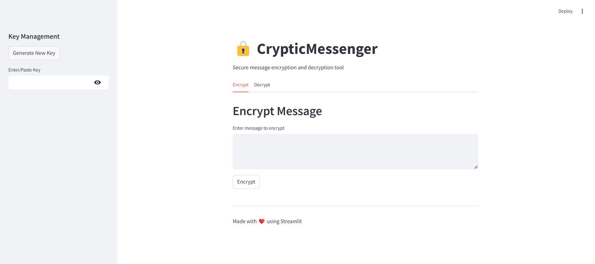

# CrypticMessenger 🔒

A secure, web-based message encryption and decryption application built with Streamlit. CrypticMessenger provides an intuitive interface for encrypting sensitive messages using the Fernet symmetric encryption scheme.



## 🌟 Features

- **Secure Encryption**: Uses Fernet symmetric encryption for secure message handling
- **Key Generation**: One-click secure key generation
- **User-Friendly Interface**: Clean, intuitive web-based interface
- **Cross-Platform**: Works on any device with a web browser
- **Real-Time Processing**: Instant encryption and decryption
- **Secure Key Handling**: Password-protected key input field
- **Error Handling**: Comprehensive error messages and input validation
- **Mobile Responsive**: Works seamlessly on desktop and mobile devices

## 🚀 Live Demo

Visit the live application at: [https://encryption-decryption-app-ceuash8hqsmtpmc7nndjmy.streamlit.app/](https://encryption-decryption-app-ceuash8hqsmtpmc7nndjmy.streamlit.app/)

## 💻 Local Development

### Prerequisites

- Python 3.7 or higher
- pip (Python package installer)

### Installation

1. Clone the repository
```bash
git clone https://github.com/Manish-Kumar24/Encryption-Decryption-App.git
cd Encryption-Decryption-App
```

2. Create a virtual environment (optional but recommended)
```bash
python -m venv venv
source venv/bin/activate  # On Windows, use: venv\Scripts\activate
```

3. Install dependencies
```bash
pip install -r requirements.txt
```

### Running Locally

```bash
streamlit run app.py
```

The application will open in your default web browser at `http://localhost:8501`.

## 🌐 Live Application

This application is deployed and accessible at:
[https://encryption-decryption-app-ceuash8hqsmtpmc7nndjmy.streamlit.app/](https://encryption-decryption-app-ceuash8hqsmtpmc7nndjmy.streamlit.app/)

Feel free to visit the link above to use the CrypticMessenger encryption tool!

## 🔒 Security Notes

- The application uses Fernet symmetric encryption, which provides secure encryption for most use cases
- Keys are never stored on the server and are only held in the session state
- Always share encryption keys through secure channels
- Clear your browser cache and session data after using the application on shared devices

## 🛠️ Technical Details

### Built With

- [Streamlit](https://streamlit.io/) - The web framework used
- [cryptography](https://cryptography.io/) - For encryption/decryption
- Python 3.7+ - Base programming language

### File Structure

```
Encryption-Decryption-App/
│
├── app.py              # Main application file
├── requirements.txt    # Project dependencies
└── README.md          # Documentation
```

## 📝 Usage Guidelines

1. **Generating a Key**:
   - Click "Generate New Key" in the sidebar
   - Save the generated key securely

2. **Encrypting Messages**:
   - Enter or paste your key in the sidebar
   - Switch to the "Encrypt" tab
   - Enter your message
   - Click "Encrypt"

3. **Decrypting Messages**:
   - Enter or paste your key in the sidebar
   - Switch to the "Decrypt" tab
   - Paste the encrypted message
   - Click "Decrypt"

## 🤝 Contributing

Contributions are welcome! Please feel free to submit a Pull Request.

1. Fork the repository
2. Create your feature branch (`git checkout -b feature/AmazingFeature`)
3. Commit your changes (`git commit -m 'Add some AmazingFeature'`)
4. Push to the branch (`git push origin feature/AmazingFeature`)
5. Open a Pull Request

## 📄 License

This project is licensed under the MIT License - see the [LICENSE](LICENSE) file for details.

## 🙏 Acknowledgments

- Built with Streamlit's awesome framework
- Uses the cryptography package for secure encryption
- Inspired by the need for accessible, secure message encryption

## 📧 Contact

Your Name - [manishkumar202209@gmail.com](manishkumar202209@gmail.com)

Project Link: [https://github.com/Manish-Kumar24/Encryption-Decryption-App](https://github.com/Manish-Kumar24/Encryption-Decryption-App)